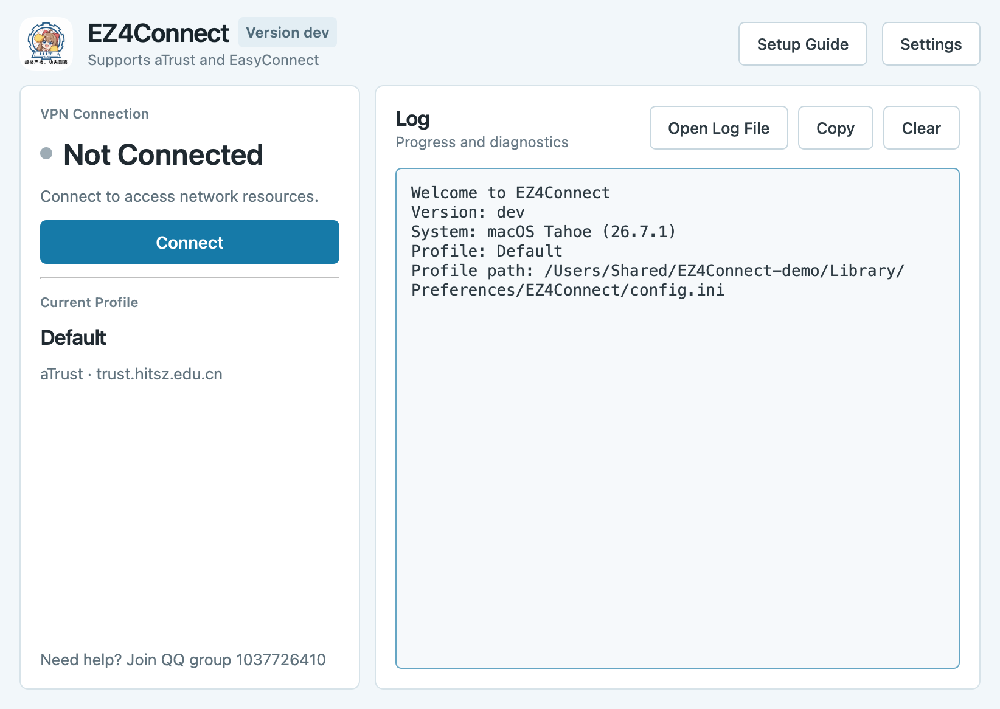

# EZ4Connect

*Formerly HITsz Connect for Windows*


An improved graphical interface for ZJU-Connect.

> **About this fork.** This is a fork of [chenx-dust/EZ4Connect](https://github.com/chenx-dust/EZ4Connect)
> with an English interface and a number of fixes. The badges and release
> downloads below belong to the upstream project, whose builds have a Chinese
> interface and do not include these changes. To get this fork's version,
> build it from source (see [Development](#development)).

## 🎉 aTrust is now officially supported

If you run into problems, you can join the ZJU-Connect user feedback QQ group: 1037726410.

<div align="center">

</div>

## Usage

Download the latest version from the upstream [Releases](https://github.com/chenx-dust/EZ4Connect/releases) page:

- **Windows**: download `EZ4Connect-vX.X.X-windows-ARCH.zip`, extract everything into one folder, and double-click `EZ4Connect.exe`.
  - If you get errors about missing DLLs, install the Microsoft Visual C++ Redistributable ([x64](https://aka.ms/vs/17/release/vc_redist.x64.exe) | [arm64](https://aka.ms/vs/17/release/vc_redist.arm64.exe)) first, then run the program.
- **macOS**: download `EZ4Connect-vX.X.X-macOS-ARCH.dmg` and move EZ4Connect into the Applications folder.
  - The upstream builds are notarized by Apple and run without extra steps.
- **Linux**: download `EZ4Connect-vX.X.X-linux-ARCH.AppImage`, make it executable, and run it.
  - The x64 AppImage only supports distributions with `glibc >= 2.31`; Ubuntu 22.04 and later work (a limit of the GitHub Actions runner).
  - The arm64 AppImage only supports distributions with `glibc >= 2.38`; Ubuntu 24.04 and later work (a limit of the official Qt builds: [reference](https://doc.qt.io/qt-6/supported-platforms.html)).
  - Arch Linux users are encouraged to install from the [AUR](https://aur.archlinux.org/packages/ez4connect).
  - If it will not run because of dependency problems, build it from source.

Then:

1. Follow the Setup Guide to configure the server and your account, or configure them by hand in Settings.
2. Click **Connect** in the main window. If you only need to browse internal sites, click **Set System Proxy** and you are done.

For advanced traffic splitting together with Clash / Mihomo, see [Advanced usage](docs/ADVANCED_USAGE.md).

## Roadmap

Suggestions are welcome in the Issues or in the OSA group.

- [X] macOS support
- [X] Linux support
- [X] Manually configurable proxy bypass
- [X] AUR package
- [X] Store passwords in the system keychain (in this fork, when built with QtKeychain)

## Development

The layering, dependency direction and rules for where new code belongs are described in the
[architecture notes](docs/ARCHITECTURE.md).

### Building

You need CMake, a C++17 compiler and Qt 6.5 or later with these modules: Core, Concurrent, Gui,
Widgets, Network, Svg, Core5Compat and WebEngineWidgets.

[QtKeychain](https://github.com/frankosterfeld/qtkeychain) is optional. When CMake finds it, saved
passwords are kept in the macOS Keychain, Windows Credential Manager or the Linux Secret Service.
Without it they stay in the profile file, as in upstream.

```bash
cmake -S . -B build -DCMAKE_BUILD_TYPE=Release
cmake --build build --parallel
ctest --test-dir build --output-on-failure
```

On macOS with Homebrew, the dependencies are:

```bash
brew install cmake qtbase qtsvg qt5compat qtwebengine qtkeychain
cmake -S . -B build -DCMAKE_BUILD_TYPE=Release -DCMAKE_PREFIX_PATH=/opt/homebrew
```

The app needs the `zju-connect` core next to its own executable (inside `EZ4Connect.app/Contents/MacOS/`
on macOS) or on `PATH`. The scripts in `scripts/` download the core and assemble a distributable
package for each platform; they are what the release workflow runs.

## License

This project is released under the [GNU General Public License Version 3](LICENSE).

## Acknowledgements

- [Mythologyli/ZJU-Connect-for-Windows](https://github.com/Mythologyli/ZJU-Connect-for-Windows)
- [Mythologyli/zju-connect](https://github.com/Mythologyli/zju-connect)

> You are welcome to join the HITSZ Open Source Association [@hitszosa](https://github.com/hitszosa)
