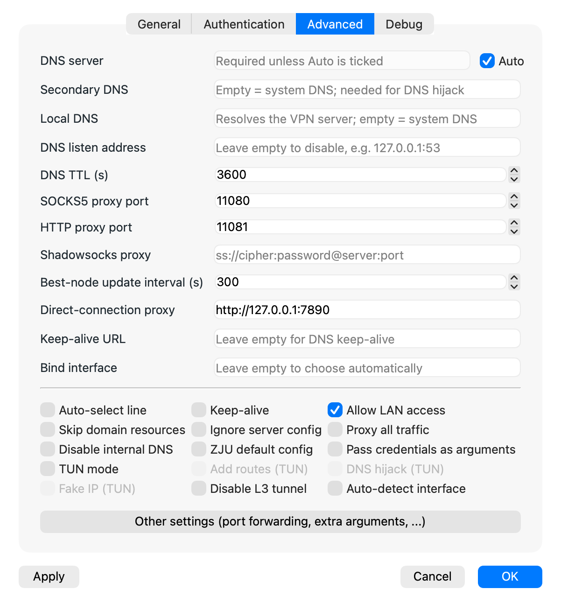

# Advanced usage

## Splitting traffic with Clash / Mihomo

To use Clash, Mihomo or another proxy app together with EZ4Connect, pick one of two arrangements:

1. **EZ4Connect as the main proxy**: turn on EZ4Connect's system proxy, and let it forward the traffic it does not need to handle to Clash or Mihomo through its direct-connection proxy.
2. **Clash/Mihomo as the main proxy**: turn off EZ4Connect's system proxy, and have Clash forward the traffic that needs the VPN to EZ4Connect.

The steps for each follow.

### Option 1: EZ4Connect as the main proxy

- In **Settings → Advanced**, set **Direct-connection proxy** to the port Clash (or similar) listens on, for example `http://127.0.0.1:7890`.
- Make sure **Allow LAN access** is ticked.
- Turn on EZ4Connect's system proxy.
- Start Clash without its system proxy or TUN mode; traffic is then forwarded correctly.

<div align="center">

</div>

### Option 2: Clash as the main proxy

- Clear EZ4Connect's system proxy.
- In **Settings → Advanced**, set the SOCKS5 proxy port (11080 in this example). The recommended configuration follows.

Add a proxy server to Clash's proxy configuration:

```yaml
# Proxy server
proxies:
  - name: 🖥 EZ4Connect
    type: socks5
    server: 127.0.0.1
    port: 11080
    udp: true
```

Add a separate proxy group:

```yaml
proxy-groups:
  - name: "🏫 Campus"
    type: select
    proxies:
      - DIRECT
      - 🖥 EZ4Connect
```

And add these rules:

```yaml
rules:
  - DOMAIN,ids.hit.edu.cn,DIRECT      # authentication server
  - DOMAIN,trust.hitsz.edu.cn,DIRECT  # aTrust server
  - DOMAIN-SUFFIX,hitsz.edu.cn,🏫 Campus
  - IP-CIDR,10.0.0.0/8,🏫 Campus,no-resolve
  # Add any other IP ranges you need proxied here, such as the course centre
```

With this in place a single switch does the job: choose the EZ4Connect proxy when you are off campus, and DIRECT when you are on campus.

<div align="center">

</div>

## TUN mode

### Clash as the main proxy

In this arrangement Clash provides the TUN virtual network adapter. It captures all traffic and sends whatever matches its rules to the EZ4Connect proxy.

EZ4Connect then splits the traffic it receives internally: what needs the VPN (campus traffic by default) goes into the VPN tunnel, and the rest is let through directly.

**Take particular care here.** Because of Clash's TUN adapter, the traffic EZ4Connect sends out comes back to Clash. In this arrangement you **must add rules that exclude that traffic**, or it is proxied back to EZ4Connect again and loops.

1. Clear EZ4Connect's system proxy. No direct-connection proxy is needed. Make sure **Allow LAN access** is ticked.
2. Configure TUN in Clash.

The recommended configuration follows.

Add a proxy server to Clash's proxy configuration:

```yaml
# Proxy server
proxies:
  - name: 🖥 EZ4Connect
    type: socks5
    server: 127.0.0.1
    port: 11080
    udp: true
```

Add a separate proxy group:

```yaml
proxy-groups:
  - name: "🏫 Campus"
    type: select
    proxies:
      - DIRECT
      - 🖥 EZ4Connect
```

And add these rules:

```yaml
rules:
  - DOMAIN,ids.hit.edu.cn,DIRECT      # authentication server
  - DOMAIN,trust.hitsz.edu.cn,DIRECT  # aTrust server
  - PROCESS-NAME,zju-connect.exe,DIRECT
  - PROCESS-NAME,EZ4Connect.exe,DIRECT
  - DOMAIN-SUFFIX,hitsz.edu.cn,🏫 Campus
  - IP-CIDR,10.0.0.0/8,🏫 Campus,no-resolve
  # Add any other IP ranges you need proxied here, such as the course centre
```

Notes:

- `PROCESS-NAME` matches the networking processes `EZ4Connect.exe` and `zju-connect.exe` exactly.
- As long as they match correctly, you can keep either the `DOMAIN` rules or the `PROCESS-NAME` rules, or both; `PROCESS-NAME` is recommended. They **must** come before `DOMAIN-SUFFIX,hitsz.edu.cn,🏫 Campus`, so that this traffic is let through and cannot loop.
- Recent versions of EZ4Connect can avoid the loop with the **Auto-detect interface** setting, in which case the `PROCESS-NAME` rules are not needed.

Finally, add a `fake-ip` filter to the DNS configuration. Otherwise EZ4Connect's domains resolve to fake-ip addresses and the traffic cannot be split correctly.

```yaml
dns:
  # Only needed when using fake-ip
  enhanced-mode: fake-ip
  fake-ip-filter:
    - +.hitsz.edu.cn
```

If you change the configuration dynamically with Clash's global extension script, this is a minimal example to adapt:

```javascript
// Define main function (script entry)

// DNS configuration
const dnsConfig = {
	"enhanced-mode": "fake-ip",
	"fake-ip-filter": ["+.hitsz.edu.cn"],
};

function main(config, profileName) {
	// Use the DNS settings defined above (this replaces the whole dns object).
	// Rewrite this yourself if you want to change it incrementally.
	config["dns"] = dnsConfig;

	// Campus network
	config.proxies = config.proxies || [];
	config["proxy-groups"] = config["proxy-groups"] || [];
	config.rules = config.rules || [];

	config.proxies.push({
		name: "EZ4Connect",
		type: "socks5",
		server: "127.0.0.1",
		port: 11080,
		udp: true,
	});

	config["proxy-groups"].push({
		name: "Campus",
		type: "select",
		proxies: ["DIRECT", "EZ4Connect"],
	});

	config.rules.unshift(
		"DOMAIN,trust.hitsz.edu.cn,DIRECT",
		"PROCESS-NAME,zju-connect.exe,DIRECT",
		"PROCESS-NAME,EZ4Connect.exe,DIRECT",
		"DOMAIN-SUFFIX,hitsz.edu.cn,Campus",
		"IP-CIDR,10.0.0.0/8,Campus,no-resolve",
	);

	// Return the modified configuration
	return config;
}
```

One more thing: do not add the `10.0.0.0/8` range to `tun`'s `route-exclude-address` (empty by default). If you do, that traffic is not forwarded through the TUN adapter to EZ4Connect.
